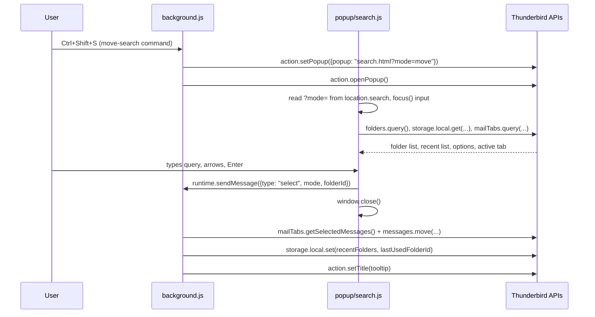

# Architecture

This document explains how Move and Jump is put together and, more
importantly, *why* — so the reasoning doesn't have to be rediscovered
every time someone (human or AI) touches this code.

## Goals that shaped every decision

- **Lean**: no bundler, no UI framework, no runtime dependencies.
  Plain ES modules, loaded directly by Thunderbird and by Node's test
  runner without a build step.
- **Modern**: Manifest V3, only standard/public WebExtension APIs —
  nothing that pokes at Thunderbird's internal chrome. That's the
  legacy pattern this add-on exists to move away from.
- **Fast**: type-ahead search runs against an in-memory folder list
  with a simple synchronous ranking function; no network, no disk
  round-trips beyond `storage.local`.

## Two decisions that don't match Nostalgy exactly

**Bare-letter shortcuts are not possible.** Nostalgy binds plain
`s`/`g` with no modifier. Thunderbird's `commands` WebExtension API
requires at least one modifier key — bare-letter shortcuts would
require a privileged "Experiment" API that hooks into the mail
window's internal DOM, i.e. exactly the fragile, chrome-coupled
legacy code this project is meant to leave behind. Instead, Move and
Jump ships modifier-based defaults (`Ctrl+Shift+S`, `Ctrl+Alt+S`,
`Ctrl+Shift+G`, `Ctrl+Alt+G`) that any user can rebind from
`about:addons` → gear icon → *Manage Extension Shortcuts*.

**There is no status-bar text.** The "last used folder" indicator
described for Nostalgy relied on Thunderbird's legacy XUL status bar,
which has no WebExtension equivalent in MV3. Move and Jump instead
sets the toolbar button's tooltip (`action.setTitle()`) to
`Move and Jump — Last: <folder path>` whenever a folder is used.

## UI mechanism: the toolbar action popup

The search UI (`popup/search.html`) is the extension's toolbar
**`action` popup**, not a hand-rolled popup `window`. Opening it via
`messenger.action.openPopup()` from a command handler means
Thunderbird handles anchoring, sizing, and dismiss-on-blur/Escape
natively — a manually created popup window would have to reimplement
all of that.

The catch: `_execute_action`-style command shortcuts bypass
`commands.onCommand` entirely (Thunderbird opens the popup directly,
with no hook to tell it *why*). Since "move" and "jump" need the same
popup in two different modes, both get their own named command
instead:

| Command | Default key | Behavior |
|---|---|---|
| `move-search` | `Ctrl+Shift+S` | Open the popup in "move" mode |
| `move-last` | `Ctrl+Alt+S` | Move selection to the last-used folder, no popup |
| `jump-search` | `Ctrl+Shift+G` | Open the popup in "jump" mode |
| `jump-last` | `Ctrl+Alt+G` | Jump to the last-used folder, no popup |

`background.js`'s `commands.onCommand` handler passes the mode
(`"move"` or `"jump"`) to the popup via a **query string on the popup
URL** (`action.setPopup({popup: "popup/search.html?mode=move"})`
immediately followed by `action.openPopup()`, then reset back to the
plain URL once the popup has opened so a plain toolbar-button click
always starts in "move" mode). `popup/search.js` reads `?mode=` from
`window.location.search` synchronously on load.

### The user-gesture pitfall

This *has* to be a URL parameter rather than something written to
`storage.session` first and read back by the popup, because of a real
bug we hit during testing: **any `await` before
`messenger.action.openPopup()` — even one that resolves near-instantly,
like a storage write — drops the "user gesture" status that call
requires when it's invoked from a command shortcut** (this is a
known, if under-documented, WebExtension quirk — see
[Bugzilla 1800401](https://bugzilla.mozilla.org/show_bug.cgi?id=1800401)).
`openPopup()` doesn't throw in that case; it just silently does
nothing, which is exactly what made the Ctrl+Shift+S/G shortcuts
appear completely dead. The fix has two parts:

- `openSearchPopup()` in `background.js` is a **plain, non-`async`
  function** that calls `action.setPopup()` and `action.openPopup()`
  back-to-back with no `await` in between, preserving the gesture from
  the triggering keypress.
- `move-last`/`jump-last` keep an in-memory `cachedLastUsedFolderId`
  (populated once at startup, updated on every use) instead of reading
  `storage.local` at command time, so their fallback-to-search-popup
  path (first use, before any folder has been used yet) doesn't lose
  the gesture to an `await` either.

If you're ever tempted to add an `await` ahead of an `openPopup()`
call reachable from a command handler, don't — restructure so
anything async happens after that call, or in a `.then()`.

### Grabbing focus

Separately, the search `<input>` wasn't reliably getting keyboard
focus when the popup opened — keystrokes fell through to
Thunderbird's own single-letter shortcuts underneath. Popups only
auto-focus *some* element, not necessarily the one you want, and a
`.focus()` call made after `await`ing data (as the original code did)
frequently loses that race. The fix is three redundant layers, since
none of them is 100% reliable alone: the `autofocus` attribute in
`search.html`, an immediate synchronous `input.focus()` call at the
top of `search.js` (before any `await`), and a repeat `input.focus()`
once the async data load in `init()` finishes.

## Data flow



The popup talks to the WebExtension APIs (`folders.query`,
`mailTabs.query`, `storage.local`) directly rather than proxying
through the background script — extension pages have full API
access, so there's no reason to add a message round-trip just to
fetch data. Only the *action* (perform the move/jump, which must be
attributed to the right tab and update shared state) goes through
`runtime.sendMessage` to `background.js`, which is the single place
that mutates `storage.local` and the toolbar tooltip.

## Storage schema (`storage.local`)

```jsonc
{
  "recentFolders": ["folderId1", "folderId2", ...],  // MRU, capped at 10, shared by move & jump
  "lastUsedFolderId": "folderId1",                    // used by the *-last commands
  "options": {
    "caseSensitiveSearch": false,
    "searchAllAccounts": true
  }
}
```

## File layout

- `manifest.json` — MV3 manifest: permissions, commands, action, options_ui.
- `background.js` — command routing, move/jump execution against the
  `messenger.mailTabs`/`messenger.messages` APIs, MRU + tooltip
  maintenance. Deliberately thin: it calls into `lib/*.js` for any
  actual logic.
- `popup/` — `search.html`/`search.css`/`search.js`, the type-ahead UI.
- `options/` — `options.html`/`options.js`, the two-checkbox options page.
- `lib/` — pure, dependency-free logic shared by `background.js`,
  `popup/search.js`, and `options/options.js`:
  - `match.js` — filter/rank folders against a query.
  - `recent.js` — MRU list maintenance (push-to-front, dedupe, cap).
  - `folders.js` — restrict a folder list to one account.
  - `options.js` — merge stored options over defaults.
- `test/` — unit tests for everything in `lib/`, using Node's
  built-in `node:test` (see below).
- `icons/` — `icon.svg` source plus generated PNGs (via `rsvg-convert`).
- `_locales/` — standard WebExtension i18n: `en` (default), `fr`, `de`,
  `es`, `zh_CN`. Manifest strings use `__MSG_key__`; UI scripts call
  `messenger.i18n.getMessage(key)` directly (there's no HTML-level
  substitution outside `manifest.json`). The non-English translations
  were produced by Claude, not reviewed by native speakers — treat
  them as a solid starting point and open an issue/PR for corrections.

## Testing strategy

There is no reliable, lean way to drive a real Thunderbird popup in
CI (no WebDriver-equivalent for MailExtension popups), so this isn't
an end-to-end-tested add-on. Instead, the design deliberately pushes
every piece of actual *logic* — ranking, MRU maintenance, account
filtering, options merging — into plain functions in `lib/` with **no**
`messenger.*` dependency, so they're fully unit-testable with **zero
added dependencies** via Node's built-in test runner (`npm test`).
`background.js` and the UI scripts stay thin glue around those
functions plus direct `messenger.*` calls, and are verified manually
via `npm start` (loads the add-on into a real, locally-installed
Thunderbird).

## Versioning

`manifest.json` and `package.json` versions must stay in sync and
follow [semantic versioning](https://semver.org/): patch releases for
fixes/translation tweaks, minor for backward-compatible features,
major for breaking changes (storage schema changes, permission
changes that affect users, etc.). The project starts at `0.1.0`; per
semver's own rules that means even minor bumps may still break things
until it graduates to `1.0.0` once the add-on is stable/complete
enough for general use.

## Packaging

`web-ext build` packages the extension for distribution. By default
it would include everything in the repo (tests, docs, `package.json`,
the SVG icon source) — `web-ext-config.cjs` sets `ignoreFiles` to
strip all of that so the shipped `.xpi` only contains what Thunderbird
actually needs to run: `manifest.json`, `background.js`, `lib/`,
`popup/`, `options/`, the PNG icons, and `_locales/`. Both
`npm run build` and `npm run lint` load this config via `-c
web-ext-config.cjs` so they stay in sync. Note that `web-ext build`'s
default output is a `.zip` (an XPI *is* a zip, just with a different
extension) — the `--filename` flag in the `build` script names it
`.xpi` directly since that's what Thunderbird's "Install Add-on From
File" dialog expects to see.

## A note on `web-ext lint`

`web-ext lint` (via Mozilla's `addons-linter`) validates against
Firefox's manifest schema, which doesn't know about Thunderbird-only
keys. Expect these specific warnings on every run and ignore them:
`MANIFEST_PERMISSIONS` for `accountsRead`/`messagesRead`/`messagesMove`
(real Thunderbird mail permissions, not in Firefox's schema) and
`MISSING_DATA_COLLECTION_PERMISSIONS` (a Firefox-only AMO requirement).
Anything beyond those four warnings, or any `errors > 0`, is real and
should be fixed.

## License rationale

"Permissive to use and modify, but not for profit" isn't expressible
with a true permissive license (MIT/BSD/Apache place no restriction
on commercial use). [PolyForm Noncommercial 1.0.0](LICENSE) is a
plain-language, well-established license built for exactly this case:
free use, modification, and redistribution for any noncommercial
purpose, with commercial use requiring separate arrangement.
