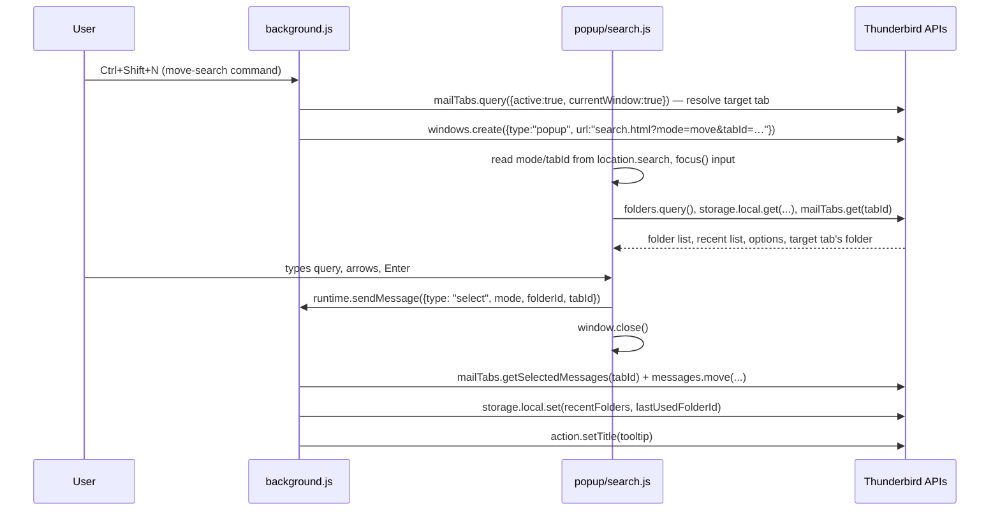

# Architecture

This document explains how Move and Jump is put together and, more
importantly, *why* — so the reasoning doesn't have to be rediscovered
every time someone (human or AI) touches this code.

## Goals that shaped every decision

- **Lean**: no bundler, no UI framework, no runtime dependencies.
  Plain ES modules, loaded directly by Thunderbird and by Node's test
  runner without a build step.
- **Modern**: Manifest V3, only standard/public WebExtension APIs —
  nothing that pokes at Thunderbird's internal chrome. That's the
  legacy pattern this add-on exists to move away from.
- **Fast**: type-ahead search runs against an in-memory folder list
  with a simple synchronous ranking function; no network, no disk
  round-trips beyond `storage.local`.

## Two decisions that don't match Nostalgy exactly

**Bare-letter shortcuts need an Experiment.** Nostalgy binds plain
`s`/`g` with no modifier. Thunderbird's `commands` WebExtension API
cannot: `ShortcutUtils.validate()` returns `MODIFIER_REQUIRED` for
anything whose only modifier is Shift, or that has none at all, and
[bug 1591730][] (an API for exactly this) has been open since 2019.
So the defaults shipped in `manifest.json` are modifier-based
(`Ctrl+Shift+N`, `Ctrl+Alt+N`, `Ctrl+Shift+H`, `Ctrl+Alt+H`),
rebindable from `about:addons` → gear icon → *Manage Extension
Shortcuts*, and single keys are available **as well**, through the
`experiments/keys/` Experiment — see [Single-key shortcuts][sk]
below for why that took the shape it did.

The original `S`/`G`-based defaults were dropped after real-world
testing found both unusable: `Ctrl+Shift+S` collides with something
outside Thunderbird (exact cause unconfirmed — likely an OS/desktop
binding, e.g. a screenshot tool), and `Ctrl+Shift+G` is already a
built-in Thunderbird shortcut (as, incidentally, is `Ctrl+Shift+M` —
Thunderbird's own "move again" — which is why the `N`/`H` scheme
avoids `M` too). Note that `Alt+S` and `Alt+G` are *accepted* by the
`commands` API — one non-Shift modifier is enough — but on Windows
and Linux `Alt`+letter is claimed by the menu bar's access keys
(File/Edit/View/**Go**/Message/Tools/Help, localised), even with the
menu bar hidden. A combination the application already uses cannot be
overridden: the shortcut registers and the handler is simply never
called.

[bug 1591730]: https://bugzilla.mozilla.org/show_bug.cgi?id=1591730
[sk]: #single-key-shortcuts

**There is no status-bar text.** The "last used folder" indicator
described for Nostalgy relied on Thunderbird's legacy XUL status bar,
which has no WebExtension equivalent in MV3. Move and Jump instead
sets the toolbar button's tooltip (`action.setTitle()`) to
`Move and Jump — Last: <folder path>` whenever a folder is used.

## Single-key shortcuts

`experiments/keys/` is what makes a bare `s` or `g` possible. The
interesting part is not the feature, it's that the obvious
implementation does not work and fails *silently*.

### The approach that looks right and isn't

Thunderbird binds its own single letters with XUL `<key>` elements —
`mail/base/content/mainKeySet.inc.xhtml` is full of them:

```xml
<key id="key_nextMsg" key="&nextMsgCmd.key;" oncommand="goDoCommand('cmd_nextMsg')"/>
```

No `modifiers` attribute at all. And `ExtensionShortcuts` builds the
same elements at runtime for the shortcuts `commands` *does* support,
so the machinery is clearly reachable from an add-on. Building the
missing modifier-less ones the same way is the obvious move.

It does not work. Measured against Thunderbird 153.2.0, firing a
synthesised keystroke and counting `command` events:

| what was inserted                                  | fires |
| -------------------------------------------------- | ----- |
| own keyset, `key="s"`, no modifiers                 | no    |
| own keyset, `key="s"`, `modifiers="alt"`            | yes   |
| same element, inside Thunderbird's own `mailKeys`   | no    |
| exact clone of a working built-in, letter changed   | no    |
| the built-in itself (control)                       | yes   |

The discriminator is not the element, the keyset, or where either is
placed — an exact clone of a built-in that works, with only the letter
changed, still does nothing. It is *modifier-less* plus *inserted after
the window's handler chain was built*. Keys carrying a modifier are
picked up when added at runtime; keys without one are only honoured if
they were there when the window was built. Nothing reports an error;
the binding is simply inert.

### What the Experiment actually does

A `keydown` listener on each mail window, in the capture phase — the
same approach [tbkeys][] takes. The one thing that had to be checked
first is whether such a listener sees keys pressed in the message
list, since Thunderbird 115 moved that into an `about:3pane` document
inside a `<browser>`. It does, and the event arrives with the real
inner element as its target (`ul#folderTree`), not the `<browser>` —
which is what makes the typing test below possible at all.

Two consequences follow from not going through Thunderbird's own key
handling:

- **Quiet-while-typing is no longer free.** Chrome key handlers run
  after the focused element, so an editor that consumed the keystroke
  has already stopped them; that is why `n` doesn't jump to the next
  message while you type in the quick filter. A DOM listener runs
  first and has to ask, which is `isTypingContext()` — a tag list
  taken from tbkeys' `stopCallback` (the Thunderbird-specific search
  boxes are the ones you would not guess), plus `isContentEditable`
  and `designMode`. Verified: the quick filter box resolves to
  `search-bar` and is correctly treated as typing.
- **Overriding a built-in works.** Capture phase runs ahead of
  Thunderbird's handlers, and `preventDefault()` stops them, so a user
  who binds `n` gets Move and Jump rather than "next unread message".
  Because that is a surprise rather than a gift, `keys.check()`
  reports what a key would shadow (`systemKeyFor()`, a variant of
  `ShortcutUtils.isSystem()` that returns *which* key it hit) and the
  options page says so. Worth knowing: plain `s` is not free —
  it is Thunderbird's `key_toggleFlagged`.

**Limitation.** A rendered message body is a remote `<browser>`; its
keystrokes never reach the chrome window, so a single key does not
fire while focus is inside the message text. Thunderbird's own
letters still do, because they go through the path described above.

### Event delivery across a sleeping background

The background is an MV3 event page and gets suspended, which takes a
plain `EventManager` listener down with its context. The documented
answer is a primed listener — `ExtensionAPIPersistent` plus a
`PERSISTENT_EVENTS` block and an `EventManager({module, event,
extensionApi})`. **Do not reach for it here.** With that wiring the
API namespace was never registered at all: the module loaded, but
`getAPI()` was never called and `messenger.keys` did not exist. That
is a far worse failure than a sleeping page, and a silent one.

So the Experiment wakes the background itself: `emit()` notices that
`fires` is empty, calls `extension.wakeupBackground()`, and waits
briefly for the re-run background to re-register — which it does at
every start, including wake-ups, because the Experiment holds the
bindings in memory only (see `applySingleKeys`).

The tab id is resolved in the Experiment, from the window the key was
pressed in, via `extension.tabManager` rather than a context: when the
event page is asleep there is no context to ask.

### Never let the Experiment take the add-on down with it

`messenger.keys` is read **once, inside a try/catch**, in both
`background.js` (`keysApi`) and `options/options.js`. This is not
belt-and-braces: an experiment namespace that fails to register does
not necessarily read back as `undefined` — *the property access itself
can throw*. Both files touched it at module scope, so a single
unguarded read killed the entire background (every command, the
toolbar button, move and jump) and blanked the whole options page,
because of an optional extra. `test/guards.test.js` loads both modules
against a `messenger.keys` that throws and asserts they survive.

The general rule for this add-on: the core feature must never be able
to fail because a privileged Experiment did. `columns` follows the
same rule by only ever being called from inside a `try`/`catch`.

[tbkeys]: https://github.com/wshanks/tbkeys

## UI mechanism: a real popup window (not the toolbar action popup)

This went through two designs before landing here — both revisions
are worth understanding, because the second one is a real,
production-observed platform bug, not a hypothetical.

**Revision 1 (toolbar `action` popup panel).** The original design
opened the search UI via `messenger.action.openPopup()` from a command
handler, so Thunderbird would handle anchoring, sizing, and
dismiss-on-blur/Escape natively. Two problems surfaced in real-world
testing on Linux:

- **The keyboard shortcuts did nothing at all.** Root cause: any
  `await` before `messenger.action.openPopup()` — even one that
  resolves near-instantly, like a storage write — drops the "user
  gesture" status that call requires when invoked from a command
  shortcut (a known, under-documented WebExtension quirk; see
  [Bugzilla 1800401](https://bugzilla.mozilla.org/show_bug.cgi?id=1800401)).
  `openPopup()` doesn't throw in that case, it just silently does
  nothing. The original code awaited a `storage.session` write first,
  which was the bug.
- **The popup opened, but keystrokes didn't reach the search input.**
  This one survived even after fixing the gesture issue above and
  making the input take DOM focus (visible blinking caret) — typed
  characters still fell through to Thunderbird's own single-letter
  shortcuts underneath. That combination (element *has* DOM focus, but
  keystrokes go to the window behind it) points at the anchored popup
  panel not actually being handed real window-manager-level keyboard
  focus on this platform — a known category of Gecko/GTK panel-focus
  bugs on Linux, distinct from the ordinary "focus a DOM element"
  problem the first fix addressed.

**Revision 2 (current): a genuine top-level window**, created with
`messenger.windows.create({type: "popup", ...})`. This sidesteps both
problems at once: `windows.create()` isn't gated by the user-gesture
requirement `action.openPopup()` has, and a real top-level window is
subject to normal window-manager focus handling instead of whatever
special-cased handling anchored panels get.

The trade-off: none of the popup panel's native conveniences come for
free anymore.

- **Anchoring/sizing**: gone; `openSearchWindow()` in `background.js`
  computes a centered position from `windows.getCurrent()` instead.
- **Dismiss-on-blur**: reimplemented via `window.addEventListener("blur",
  ...)` in `search.js`, which calls the same `hide()` every other
  dismissal path uses. This turned out to have a sharp edge: selecting a
  folder with **Enter** appeared to do nothing (no move, no error),
  while clicking the exact same list item worked fine. Working theory:
  Enter — unlike the arrow keys — causes this window to lose focus as a
  side effect, firing the blur handler while `select()`'s `sendMessage`
  call was still in flight and dismissing the window before the
  move/jump could actually happen; a plain click never blurs the
  window, so it was unaffected. Fixed with a `hiding` flag set the
  moment a selection or Escape is confirmed, which the blur handler
  checks before acting — once we're dismissing on purpose, a racing
  blur is a no-op. (`hide()` itself minimizes rather than closes; see
  the reuse note below.)
- **`window.close()` from content script**: real popup windows block
  script-initiated close by default; `windows.create()` is called with
  `allowScriptsToClose: true` to allow it.
- **Passing which mode ("move"/"jump") to open in**: done via a query
  string on the window's URL (`popup/search.html?mode=move&tabId=…`),
  read synchronously from `window.location.search` — no
  `storage.session` round-trip, no race.
- **Which mail tab to act on**: this is the one genuinely new
  correctness concern a real window introduces, and the source of two
  real bugs before it was fully sorted out. The popup used to be
  implicitly associated with the mail window, so `mailTabs.query({active:
  true, currentWindow: true})` (the `getActiveTab()` helper in
  `background.js`) naturally resolved to the right tab even from
  inside the popup's own script. A separate top-level window has no
  such association, and — this is the part that cost real debugging
  time — **`currentWindow: true` turned out not to reliably resolve a
  tab even when called from `action.onClicked` or `commands.onCommand`
  themselves**, i.e. *before* the search window exists at all. Both of
  those APIs hand the relevant tab directly to the listener as an
  argument (confirmed against the Thunderbird API docs), and that's
  the only tab source now used — `getActiveTab()`/`currentWindow` is
  kept purely as a last-resort fallback inside `openSearchWindow()`,
  not the primary path:
  - `commands.onCommand.addListener((command, tab) => ...)` — `tab` is
    "the active tab while the command occurred" (Thunderbird 106+).
  - `action.onClicked.addListener((tab) => ...)` — `tab` is the tab
    the click happened in.

  Missing this the first time around silently broke *both* the
  keyboard-shortcut and toolbar-button-click paths at different
  points: `tabId` would come back `undefined`, which
  `performMove`/`performJump`'s early-return guard turned into "do the
  whole search UI flow, pick a folder, nothing happens, no error
  anywhere." It was only diagnosable at all because of the
  `console.error` calls in that guard and in `openSearchWindow()` —
  the "could not resolve a target mail tab" message is what pinpointed
  it. The resolved tab id is threaded through explicitly from there:
  as a `tabId` URL parameter into the popup, and back out again in the
  `runtime.sendMessage({type: "select", ..., tabId})` call — never
  re-derived from "current window" once the popup exists.
- Clicking the toolbar button now fires `action.onClicked` (there's no
  `default_popup` anymore) and opens the same window in "move" mode.
- A second command fired while a search window is already open **reuses**
  it — restores (it minimizes rather than closes on dismiss) + focuses it
  and sends the popup a `reset` message to re-point its mode/tab/zoom —
  rather than piling up windows. The window is tracked in `searchWindowId`
  (`background.js`), cleared via `windows.onRemoved`.
  - `searchWindowId` lives in memory, but the background is a **non-persistent
    MV3 event page** (`manifest.json`) — Gecko suspends it after a short idle,
    wiping that variable while the popup keeps living. Relying on it alone let
    the next command open a duplicate. `openSearchWindow()` now recovers the id
    first via `findExistingSearchWindow()`, which scans `windows.getAll({populate:
    true})` for the open popup by its `popup/search.html` url. The reuse
    `windows.update` and the `reset` `sendMessage` are also in **separate**
    try/catches: a failed `reset` send (popup not ready) no longer discards the
    id and creates a duplicate — only a failed `update` (window truly gone) does.
  - Reuse is the default, not the only behaviour: the **`recreateWindow`** option
    makes `hide()` call `window.close()` instead of minimizing (allowed because
    the window is created with `allowScriptsToClose: true`), and makes
    `openSearchWindow()` `windows.remove` any leftover window and skip the reuse
    branch entirely. See `docs/settings/RECREATE_WINDOW.md`.

The lesson, if you're touching this again: don't move back to
`action.openPopup()` for this UI without re-testing keyboard focus on
Linux first. It's tempting because of the native anchoring, but it's
what caused both bugs above.

## Move/Jump/Cancel buttons and account-name disambiguation

Two related UI additions on top of the design above:

- **Explicit action buttons.** The search window always shows Move,
  Jump, and Cancel buttons rather than being locked into whichever
  mode it was opened in. `select()` in `search.js` now takes an
  explicit `actionMode` parameter instead of reading the module-level
  `mode` constant directly — Enter and clicking a list item still use
  `mode` (whichever the window opened in), but the two buttons pass
  `"move"`/`"jump"` directly, acting on `visible[activeIndex]`, the
  same folder Enter would act on. The button matching the window's
  `mode` gets the `.primary` CSS class (visually emphasized, matching
  what Enter does); this was a judgment call, not an explicit spec —
  the alternative (Move always primary regardless of how the window
  was opened) would be inconsistent with the heading text and the
  Enter key, so this seemed like the more coherent choice.
- **Account-name disambiguation.** Folder names commonly repeat across
  accounts ("Inbox", "Sent", …), which was ambiguous in the folder
  list. `search.js` now fetches `messenger.accounts.list()` alongside
  `folders.query()` and attaches each folder's account name as an
  `accountName` field. Two consequences: `lib/match.js` gained a
  fourth (lowest-priority) ranking tier that matches against
  `accountName`, so typing part of an account name helps narrow
  things down; and the rendered label becomes `"<Account>: <path>"`
  instead of just `<path>`, but *only* when more than one distinct
  `accountId` is actually present among the currently-scoped folders
  (`showAccountPrefix` in `search.js`) — with `searchAllAccounts`
  turned off, or with only one account configured, there's no
  ambiguity to resolve, so the prefix would just be noise.
- **Move/jump failures are no longer silent.** `handleSelection()` in
  `background.js` returns `{ok: true}` or `{ok: false, error}`, and
  `select()` in `search.js` checks that response before closing the
  window — on failure it shows a generic `#error` message inline
  (`popupError`) and leaves the window open (via the same `closing`
  flag the blur-race guard uses, reset back to `false`) instead of
  closing regardless of outcome. A pre-1.0 review flagged the earlier
  behavior — close unconditionally whether `sendMessage` succeeded,
  rejected, or the background handler itself failed — as exactly the
  kind of "nothing happens, no error" failure mode this project has
  already lost real debugging time to twice.

## IMAP folder name decoding

IMAP mailbox names containing non-ASCII characters are transmitted
on the wire as "modified UTF-7" (RFC 3501 — a UTF-7 variant using `&`
instead of `+` as the shift character, and a base64 alphabet with `,`
instead of `/`). Thunderbird's `folders` WebExtension API returns that
raw, still-encoded name for IMAP accounts rather than decoding it
first — a folder named "München" comes back as the literal string
`"M&APw-nchen"`. Left alone, that's exactly what users saw in the
search results and the toolbar tooltip.

`lib/imapUtf7.js` decodes it back to plain Unicode, dependency-free
(no external base64/text-decoding library — just `atob`, which is a
standard global in both Node's test runner and WebExtension pages).
It's applied in exactly two places: `popup/search.js` decodes
`folder.name`/`folder.path` once, right when building `allFolders` in
`init()` (so display, search ranking, and the recent-folders list all
see the decoded form transparently, no changes needed anywhere else);
`background.js` decodes `folder.path` when building the toolbar
tooltip. **`folder.id`/`folder.accountId` are never touched** —
those are opaque identifiers Thunderbird itself assigns and expects
back unmodified for the actual move/jump calls; only the
human-readable `name`/`path` fields need decoding.

## Search window height

The window is created at a fixed starting height, then resized once
the popup has actually rendered its initial (recent-folders) view,
so up to all 10 recent-folder entries are visible without scrolling.
This exists because a *hardcoded* pixel height inevitably breaks on
someone else's system — font size, DPI, and OS text-scale settings
all change how tall the same content actually renders, so no single
guessed number holds up across environments.

`measureRequiredWindowHeight()` in `search.js` measures this from the
real, rendered DOM instead of guessing: it briefly toggles a
`.measuring` class (see `search.css`) that lifts the folder list's
height/overflow constraints, reads `document.documentElement.scrollHeight`
(the content's true unclipped height), then converts that *content*
height into an *outer window* height by adding this window's current
chrome overhead (`window.outerHeight - window.innerHeight` — title
bar etc., whatever that happens to be on this system). The popup sends
that number to `background.js` (`{type: "resize", height}`), which
clamps it between the window's initial height (a floor, so a
first-run/empty recent-list view doesn't produce an awkwardly cramped
window, and so typed searches returning more than 10 results still
have some headroom before needing to scroll) and a generous ceiling
(guards against pathological values on unusual systems), then applies
it via `windows.update()`.

This only runs once per window, right after the initial render — not
on every keystroke while typing, which would make the window visibly
grow and shrink as the result count changes. Later, larger result sets
(e.g. a broad query matching many folders) just scroll within the
already-established size, same as before this fix.

## Data flow



The popup talks to the WebExtension APIs (`folders.query`,
`mailTabs.get`, `storage.local`) directly rather than proxying through
the background script — extension pages have full API access, so
there's no reason to add a message round-trip just to fetch data.
Only the *action* (perform the move/jump, which must be attributed to
the right tab and update shared state) goes through
`runtime.sendMessage` to `background.js`, which is the single place
that mutates `storage.local` and the toolbar tooltip.

## Storage schema (`storage.local`)

```jsonc
{
  "recentFolders": ["folderId1", "folderId2", ...],  // MRU, capped at 10, shared by move & jump
  "folderWeights": { "folderId1": 12, "folderId2": 3 }, // usage counts, uncapped, never pruned
  "queryWeights": {                                   // usage counts per typed query PREFIX
    "arch": { "folderId1": 5 },
    "archi": { "folderId1": 5 },
    "b": { "folderId2": 2 }
  },
  "lastUsedFolderId": "folderId1",                    // used by the *-last commands
  "options": {                                        // see lib/options.js (DEFAULT_OPTIONS)
    "caseSensitiveSearch": false,
    "fuzzySearch": false,
    "searchAllAccounts": true,
    "zoom": 100,                                      // percent, clamped 50-200
    "resizeToFit": true,
    "filterBody": false,                              // /filter field toggles, set from the popup
    "filterRecipients": false,
    "centerOnParent": true,
    "recreateWindow": false,                          // close the search window on dismiss instead of minimizing it
    "singleKeys": { "move-to-folder": "Shift+M" }     // command name -> bare-key shortcut
  }
}
```

`getOptions()` (`lib/options.js`) merges the stored object over
`DEFAULT_OPTIONS`, so adding a key here never needs a storage migration — and
the page-level writers (`options/options.js`'s `save()`, the popup's slash
commands) merge over `getOptions()` first, so a key with no control on the page
isn't dropped when an unrelated checkbox changes.

## Frequency-weighted search ranking and match highlighting

Two small, related additions, both implemented as pure functions in
`lib/` per the project's usual pattern (push logic out of the
`messenger.*`-calling glue, keep it independently unit-testable):

- **`lib/weights.js`**: `incrementWeight()` bumps a folder's usage
  count by 1 (called from `recordUsage()` in `background.js`, right
  alongside the existing `recentFolders` MRU update — same trigger,
  different, uncapped data structure). `sortByWeight()` re-orders an
  already-*matched* folder list, most-used first, falling back to
  case-insensitive alphabetical for ties (including folders with no
  weight yet, all effectively tied at zero).
- **`lib/highlight.js`**: `findMatchRange()` finds where the query
  appears in a folder's *displayed* label (not which internal field —
  name, path, or account name — caused the match; simpler and always
  correct regardless of that, since it just looks at what's on
  screen). Returns `null` if the query is blank, or — a real edge
  case — if a folder matched via its account name but the account
  prefix isn't currently shown (`showAccountPrefix` is false), so the
  query doesn't appear in the label at all; `search.js` falls back to
  plain unhighlighted text in that case rather than forcing a highlight
  that isn't there.

Two decisions worth being explicit about, since both were genuinely
open questions the first time this was discussed (see the git history
around `lib/match.js` and `ROADMAP.md`):

- **Weight is the primary sort key for search hits, full stop** —
  not a tie-breaker within `lib/match.js`'s existing name/path/account
  match-quality tiers. Those tiers still decide *which* folders match a
  query at all (`filterFolders()` is completely unchanged); `search.js`
  just re-sorts that result set by weight afterward. A frequently-used
  folder that only matches on path can now rank above a rarely-used
  folder that matches on name.
- **Only the typed-search hit list is weight-sorted.** The empty-query
  "recent folders" view keeps using the existing recency-based MRU
  list unchanged — a deliberate choice to leave that already-named,
  already-working feature alone rather than conflating recency and
  frequency into one ranking.

`search.js` builds the highlighted `<li>` content with real DOM nodes
(`document.createTextNode` for the non-matching parts, a `<mark>`
element for the match) rather than `innerHTML`, consistent with the
rest of the popup. `<mark>` is styled with `color: var(--active-bg)` +
bold instead of a background, so it doesn't fight with `li.active`'s
own background/text color when the highlighted row is also the
currently-selected one.

### Per-query weighting

The plain global weight above answers "which folder do I use most
overall" — it doesn't distinguish *why* you're searching right now.
If you always type `"arch"` for one folder and `"budg"` for a totally
different one, a single global-most-used folder would incorrectly
outrank the right answer for whichever query you *didn't* mostly type.
`incrementQueryWeight()`/`sortByQueryWeight()` in `lib/weights.js`
track weight per typed **query prefix** instead, so ranking reflects
"which folder do I pick after typing *this*," not just "which folder
do I pick most."

- **Fan-out on write, direct lookup on read.** When a folder is
  selected, `incrementQueryWeight()` increments the count for *every
  prefix* of the (trimmed, lowercased) query that was typed — selecting
  a folder after typing `"archive"` credits `"a"`, `"ar"`, …,
  `"archiv"`, and `"archive"` itself, all in one write. This means a
  *shorter* query typed on some future occasion still finds the
  association (typing just `"arch"` next time already has a
  `queryWeights["arch"]` entry from that earlier fan-out), while a
  *longer* one won't (typing `"archiver"` — more than was ever typed
  before — finds nothing, and falls through to the weaker signals
  below). That's a deliberate, acceptable asymmetry: it's what makes
  read-time lookup a plain, fast `O(1)` key access instead of scanning
  for prefix relationships on every keystroke, and the cost only ever
  falls on typing *more* than your own past habit, not less.
- **Three-level fallback, composed from two stable sorts.**
  `sortByQueryWeight()` doesn't write a three-key comparator by hand —
  it calls `sortByWeight(folders, globalWeights)` first (that's already
  "global weight, then alphabetical"), then does one more `.sort()` on
  top keyed only by query weight. `Array.prototype.sort` has been
  required to be stable since ES2019, so that second pass only
  reorders folders that actually differ in query weight; anything tied
  at zero (the common case for a query you've never typed before)
  keeps exactly the order the first pass already established. Net
  effect: query weight, then global weight, then alphabetical — without
  three `if` branches to get subtly wrong.
- **Storage cost is genuinely negligible**, which was asked about
  directly before building this: growth is bounded by the number of
  *distinct* (prefix, folder) pairs ever selected, not by keystrokes —
  fan-out happens once per selection, not once per render. Even heavy
  long-term use lands in the hundreds-to-low-thousands of small integer
  entries, comfortably inside `storage.local`'s quota.
- **Explaining this to the user matters more than the mechanism.**
  This is genuinely non-obvious behavior — a folder's rank now depends
  on invisible history, not just what's currently typed — so the
  options page carries a plain-language paragraph
  (`optionsRankingInfo`) explaining the three-level fallback in one
  sentence, deliberately without mentioning prefixes, fan-out, or any
  other implementation detail from this section.

## Error logging convention

The tab-resolution bug above was only findable at all because of
`console.error("Move and Jump: ...", ...)` calls at each point where a
required value (`tabId`, a selected folder) could silently come back
missing — those, plus a temporary round of `console.log` tracing
through the whole select → message → move/jump chain, are what turned
"nothing happens, no error" into an exact diagnosis from the Browser
Console. The `console.log` tracing was removed once the bug was fixed
(this is a small, synchronous-by-default extension — it doesn't need
permanent verbose tracing), but the `console.error` calls at each
"this should never be undefined" guard are staying, prefixed
`Move and Jump:` for easy filtering. If you add a new code path with a
similar "silently do nothing if some value is missing" guard, log it
the same way rather than failing silently — this bug cost multiple
rounds of guessing specifically because the first version didn't.

## File layout

- `manifest.json` — MV3 manifest: permissions, commands, action, options_ui.
- `background.js` — command routing, move/jump execution against the
  `messenger.mailTabs`/`messenger.messages` APIs, MRU + tooltip
  maintenance. Deliberately thin: it calls into `lib/*.js` for any
  actual logic.
- `popup/` — `search.html`/`search.css`/`search.js`, the type-ahead UI.
- `options/` — `options.html`/`options.js`, the options page: a set of
  checkboxes and a zoom input, all backed by the single `options` object in
  `storage.local` (`lib/options.js`). Also renders a short explanatory intro and a live table of
  the current keyboard shortcuts, built from `messenger.commands.getAll()`
  rather than hardcoded — it reflects whatever the user has actually
  rebound them to, not just the shipped defaults. This is also the
  practical answer to "add explanatory text to the Add-ons Manager
  detail view": that view itself only renders the manifest's one-line
  `description`, with no field for anything longer for a
  locally-installed (non-ATN-listed) extension — the options page,
  one click away via the *Preferences* button, is where a fuller
  explanation can actually live.
- `lib/` — pure, dependency-free logic shared by `background.js`,
  `popup/search.js`, and `options/options.js`:
  - `match.js` — filter/rank folders against a query.
  - `recent.js` — MRU list maintenance (push-to-front, dedupe, cap).
  - `folders.js` — restrict a folder list to one account.
  - `options.js` — merge stored options over defaults.
  - `imapUtf7.js` — decode IMAP "modified UTF-7" (RFC 3501) mailbox
    names into plain Unicode.
  - `weights.js` — track and sort by per-folder usage counts, both
    global and per-typed-query-prefix.
  - `highlight.js` — find where a query matches in a displayed label.
  - `keys.js` — recognise and validate the modifier-less shortcuts
    `commands` refuses (see [Single-key shortcuts][sk]); also the list
    of command names shared with `background.js`.
- `experiments/` — the two privileged WebExtension Experiments, each a
  `schema.json` plus an `implementation.js`. Both reach into
  Thunderbird's internals, so both feature-detect everything and
  degrade to "unavailable" rather than throwing:
  - `columns/` — message-list column visibility, for `/columns`.
  - `keys/` — single-key shortcuts.
- `test/` — unit tests for everything in `lib/`, using Node's
  built-in `node:test` (see below).
- `icons/` — `icon.svg` source plus generated PNGs (via `rsvg-convert`).
- `_locales/` — standard WebExtension i18n: `en` (default), `fr`, `de`,
  `es`, `zh_CN`. Manifest strings use `__MSG_key__`; UI scripts call
  `messenger.i18n.getMessage(key)` directly (there's no HTML-level
  substitution outside `manifest.json`). The non-English translations
  were produced by Claude, not reviewed by native speakers — treat
  them as a solid starting point and open an issue/PR for corrections.

## Testing strategy

There is no reliable, lean way to drive a real Thunderbird popup in
CI (no WebDriver-equivalent for MailExtension popups), so this isn't
an end-to-end-tested add-on. Instead, the design deliberately pushes
every piece of actual *logic* — ranking, MRU maintenance, account
filtering, options merging — into plain functions in `lib/` with **no**
`messenger.*` dependency, so they're fully unit-testable with **zero
added dependencies** via Node's built-in test runner (`npm test`).
`background.js` and the UI scripts stay thin glue around those
functions plus direct `messenger.*` calls, and are verified manually
via `npm start` (loads the add-on into a real, locally-installed
Thunderbird).

## Versioning

`manifest.json` and `package.json` versions must stay in sync and
follow [semantic versioning](https://semver.org/): patch releases for
fixes/translation tweaks, minor for backward-compatible features,
major for breaking changes (storage schema changes, permission
changes that affect users, etc.). The project started at `0.1.0` and
reached `1.0.0` on 2026-07-29, after real production use, a full
debugging cycle (see [CHANGELOG.md](CHANGELOG.md)), and a pre-release
review — from here on, breaking changes require a major bump rather
than being allowed under semver's pre-1.0 "anything goes" rule.

## Publishing to addons.thunderbird.net (ATN)

The add-on's first-ever submission (1.2.0) was done by hand through
ATN's web UI — that's inherently a one-time, account-specific step
(choosing categories, confirming the license, etc. — the "storefront"
listing metadata isn't just an XPI upload). Every release after that
is automated by `.github/workflows/release.yml`.

- **Trigger: pushing a version tag (`vX.Y.Z`), not every push to
  `main`.** Publishing to a public add-on store is a deliberate,
  externally-visible action with real (if not permanent) consequences
  — it shouldn't be an automatic side effect of landing a commit the
  way `ci.yml` validating a push is. The release flow is: bump
  `manifest.json`/`package.json`, commit, then tag **and push** —
  the tag push is the actual "publish" action:

  ```sh
  git tag -a vX.Y.Z -m "One-paragraph summary of what's in this release"
  git push origin vX.Y.Z
  ```

  **Must be an annotated tag (`-a`) with a real `-m` message** — the
  release step below uses that message verbatim as the GitHub
  release's notes. A lightweight tag (`git tag vX.Y.Z` with no `-a`)
  has no message to read, so the release would ship with empty notes.
  (1.0.0 through 1.2.0 predate this workflow and were never tagged at
  all, which is why the repo had no GitHub releases yet.)
- **The workflow verifies the tag matches `manifest.json`'s version**
  before doing anything else (`node -p "require('./manifest.json').version"`),
  so tagging the wrong commit or forgetting to bump the version fails
  fast instead of publishing something unintended.
- **Signing/submission uses [`kewisch/action-web-ext`](https://github.com/kewisch/action-web-ext)**
  (maintained by a longtime Thunderbird add-on ecosystem contributor),
  which wraps `web-ext sign` — the same tool `npm run build`/`npm run
  lint` already use — pointed at `https://addons.thunderbird.net/api/v4`
  instead of its Firefox/AMO default. Authentication is a JWT signed
  with an API key/secret pair from the ATN account's Developer Hub,
  stored as the `ATN_API_KEY`/`ATN_API_SECRET` repository secrets (not
  committed anywhere, obviously — generate them at ATN, add them via
  the GitHub repo's Settings → Secrets and variables → Actions).
- **`approvalTimeout: 0`**: the workflow waits for automated
  validation to pass, then stops — it doesn't block on full human
  review, which for a listed add-on can take considerably longer than
  a CI run should reasonably wait. The public ATN listing updates
  whenever review actually completes, independent of this workflow's
  lifetime.
- **A GitHub Release is also created**, with the built `.xpi`
  attached, via the `gh` CLI (already available on GitHub-hosted
  runners — no extra action needed) rather than through ATN, giving a
  second, independent download path and a version history outside
  Mozilla's infrastructure.
- Building still goes through the project's own `npm run build` (with
  `web-ext-config.cjs`'s file-exclusion rules), not a separate build
  step inside the action — one source of truth for what a release
  package actually contains, matching local dev builds exactly.

## Packaging

`web-ext build` packages the extension for distribution. By default
it would include everything in the repo (tests, docs, `package.json`,
the SVG icon source) — `web-ext-config.cjs` sets `ignoreFiles` to
strip all of that so the shipped `.xpi` only contains what Thunderbird
actually needs to run: `manifest.json`, `background.js`, `lib/`,
`popup/`, `options/`, the PNG icons, and `_locales/`. Both
`npm run build` and `npm run lint` load this config via `-c
web-ext-config.cjs` so they stay in sync. Note that `web-ext build`'s
default output is a `.zip` (an XPI *is* a zip, just with a different
extension) — the `--filename` flag in the `build` script names it
`.xpi` directly since that's what Thunderbird's "Install Add-on From
File" dialog expects to see.

## A note on `web-ext lint`

`web-ext lint` (via Mozilla's `addons-linter`) validates against
Firefox's manifest schema, which doesn't know about Thunderbird-only
keys. Expect these specific warnings on every run and ignore them:
`MANIFEST_PERMISSIONS` for `accountsRead`/`messagesRead`/`messagesMove`
(real Thunderbird mail permissions, not in Firefox's schema) and
`MISSING_DATA_COLLECTION_PERMISSIONS` (a Firefox-only AMO requirement).
Anything beyond those four warnings, or any `errors > 0`, is real and
should be fixed.

**The same three `MANIFEST_PERMISSIONS` warnings show up in ATN's own
automated validation** when submitting to addons.thunderbird.net, not
just locally — confirmed during the 1.2.0 submission. addons.thunderbird.net
runs [thunderbird/addons-server](https://github.com/thunderbird/addons-server),
a fork of AMO's server, which appears to invoke the same
Firefox-schema `addons-linter` for its automated check rather than a
Thunderbird-aware one; a related community report attributes this to
the Thunderbird team needing to pull in a newer `addons-linter`
version. It shows as a warning, not an error — validation still
passes (`0 errors`), so it doesn't block submission. Nothing to fix
here either; if it's ever worth chasing upstream, the right place is
that same `thunderbird/addons-server` repo's issue tracker.

## License rationale

"Permissive to use and modify, but not for profit" isn't expressible
with a true permissive license (MIT/BSD/Apache place no restriction
on commercial use). [PolyForm Noncommercial 1.0.0](LICENSE) is a
plain-language, well-established license built for exactly this case:
free use, modification, and redistribution for any noncommercial
purpose, with commercial use requiring separate arrangement.
