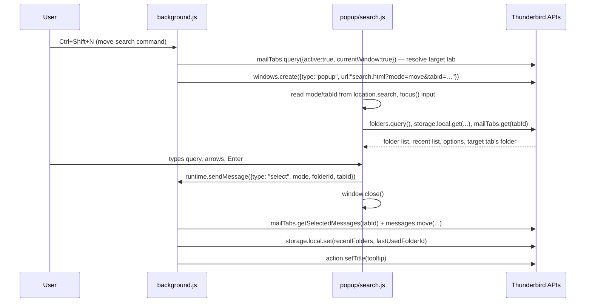

# Architecture

This document explains how Move and Jump is put together and, more
importantly, *why* — so the reasoning doesn't have to be rediscovered
every time someone (human or AI) touches this code.

## Goals that shaped every decision

- **Lean**: no bundler, no UI framework, no runtime dependencies.
  Plain ES modules, loaded directly by Thunderbird and by Node's test
  runner without a build step.
- **Modern**: Manifest V3, only standard/public WebExtension APIs —
  nothing that pokes at Thunderbird's internal chrome. That's the
  legacy pattern this add-on exists to move away from.
- **Fast**: type-ahead search runs against an in-memory folder list
  with a simple synchronous ranking function; no network, no disk
  round-trips beyond `storage.local`.

## Two decisions that don't match Nostalgy exactly

**Bare-letter shortcuts are not possible.** Nostalgy binds plain
`s`/`g` with no modifier. Thunderbird's `commands` WebExtension API
requires at least one modifier key — bare-letter shortcuts would
require a privileged "Experiment" API that hooks into the mail
window's internal DOM, i.e. exactly the fragile, chrome-coupled
legacy code this project is meant to leave behind. Instead, Move and
Jump ships modifier-based defaults (`Ctrl+Shift+N`, `Ctrl+Alt+N`,
`Ctrl+Shift+H`, `Ctrl+Alt+H`) that any user can rebind from
`about:addons` → gear icon → *Manage Extension Shortcuts*.
The original `S`/`G`-based defaults were dropped after real-world
testing found both unusable: `Ctrl+Shift+S` collides with something
outside Thunderbird (exact cause unconfirmed — likely an OS/desktop
binding, e.g. a screenshot tool), and `Ctrl+Shift+G` is already a
built-in Thunderbird shortcut (as, incidentally, is `Ctrl+Shift+M` —
Thunderbird's own "move again" — which is why the `N`/`H` scheme
avoids `M` too).

**There is no status-bar text.** The "last used folder" indicator
described for Nostalgy relied on Thunderbird's legacy XUL status bar,
which has no WebExtension equivalent in MV3. Move and Jump instead
sets the toolbar button's tooltip (`action.setTitle()`) to
`Move and Jump — Last: <folder path>` whenever a folder is used.

## UI mechanism: a real popup window (not the toolbar action popup)

This went through two designs before landing here — both revisions
are worth understanding, because the second one is a real,
production-observed platform bug, not a hypothetical.

**Revision 1 (toolbar `action` popup panel).** The original design
opened the search UI via `messenger.action.openPopup()` from a command
handler, so Thunderbird would handle anchoring, sizing, and
dismiss-on-blur/Escape natively. Two problems surfaced in real-world
testing on Linux:

- **The keyboard shortcuts did nothing at all.** Root cause: any
  `await` before `messenger.action.openPopup()` — even one that
  resolves near-instantly, like a storage write — drops the "user
  gesture" status that call requires when invoked from a command
  shortcut (a known, under-documented WebExtension quirk; see
  [Bugzilla 1800401](https://bugzilla.mozilla.org/show_bug.cgi?id=1800401)).
  `openPopup()` doesn't throw in that case, it just silently does
  nothing. The original code awaited a `storage.session` write first,
  which was the bug.
- **The popup opened, but keystrokes didn't reach the search input.**
  This one survived even after fixing the gesture issue above and
  making the input take DOM focus (visible blinking caret) — typed
  characters still fell through to Thunderbird's own single-letter
  shortcuts underneath. That combination (element *has* DOM focus, but
  keystrokes go to the window behind it) points at the anchored popup
  panel not actually being handed real window-manager-level keyboard
  focus on this platform — a known category of Gecko/GTK panel-focus
  bugs on Linux, distinct from the ordinary "focus a DOM element"
  problem the first fix addressed.

**Revision 2 (current): a genuine top-level window**, created with
`messenger.windows.create({type: "popup", ...})`. This sidesteps both
problems at once: `windows.create()` isn't gated by the user-gesture
requirement `action.openPopup()` has, and a real top-level window is
subject to normal window-manager focus handling instead of whatever
special-cased handling anchored panels get.

The trade-off: none of the popup panel's native conveniences come for
free anymore.

- **Anchoring/sizing**: gone; `openSearchWindow()` in `background.js`
  computes a centered position from `windows.getCurrent()` instead.
- **Dismiss-on-blur**: reimplemented via `window.addEventListener("blur",
  () => window.close())` in `search.js`. This turned out to have a
  sharp edge: selecting a folder with **Enter** appeared to do nothing
  (no move, no error), while clicking the exact same list item worked
  fine. Working theory: Enter — unlike the arrow keys — causes this
  window to lose focus as a side effect, firing the blur handler while
  `select()`'s `sendMessage` call was still in flight and closing (and
  destroying the JS context of) the window before the move/jump could
  actually happen; a plain click never blurs the window, so it was
  unaffected. Fixed with a `closing` flag set the moment a selection
  or Escape is confirmed, which the blur handler checks before acting
  — once we're closing on purpose, a racing blur is a no-op.
- **`window.close()` from content script**: real popup windows block
  script-initiated close by default; `windows.create()` is called with
  `allowScriptsToClose: true` to allow it.
- **Passing which mode ("move"/"jump") to open in**: done via a query
  string on the window's URL (`popup/search.html?mode=move&tabId=…`),
  read synchronously from `window.location.search` — no
  `storage.session` round-trip, no race.
- **Which mail tab to act on**: this is the one genuinely new
  correctness concern a real window introduces, and the source of two
  real bugs before it was fully sorted out. The popup used to be
  implicitly associated with the mail window, so `mailTabs.query({active:
  true, currentWindow: true})` (the `getActiveTab()` helper in
  `background.js`) naturally resolved to the right tab even from
  inside the popup's own script. A separate top-level window has no
  such association, and — this is the part that cost real debugging
  time — **`currentWindow: true` turned out not to reliably resolve a
  tab even when called from `action.onClicked` or `commands.onCommand`
  themselves**, i.e. *before* the search window exists at all. Both of
  those APIs hand the relevant tab directly to the listener as an
  argument (confirmed against the Thunderbird API docs), and that's
  the only tab source now used — `getActiveTab()`/`currentWindow` is
  kept purely as a last-resort fallback inside `openSearchWindow()`,
  not the primary path:
  - `commands.onCommand.addListener((command, tab) => ...)` — `tab` is
    "the active tab while the command occurred" (Thunderbird 106+).
  - `action.onClicked.addListener((tab) => ...)` — `tab` is the tab
    the click happened in.

  Missing this the first time around silently broke *both* the
  keyboard-shortcut and toolbar-button-click paths at different
  points: `tabId` would come back `undefined`, which
  `performMove`/`performJump`'s early-return guard turned into "do the
  whole search UI flow, pick a folder, nothing happens, no error
  anywhere." It was only diagnosable at all because of the
  `console.error` calls in that guard and in `openSearchWindow()` —
  the "could not resolve a target mail tab" message is what pinpointed
  it. The resolved tab id is threaded through explicitly from there:
  as a `tabId` URL parameter into the popup, and back out again in the
  `runtime.sendMessage({type: "select", ..., tabId})` call — never
  re-derived from "current window" once the popup exists.
- Clicking the toolbar button now fires `action.onClicked` (there's no
  `default_popup` anymore) and opens the same window in "move" mode.
- A second command fired while a search window is already open closes
  the old one first (`searchWindowId` tracked in `background.js`,
  cleared via `windows.onRemoved`) rather than piling up windows.

The lesson, if you're touching this again: don't move back to
`action.openPopup()` for this UI without re-testing keyboard focus on
Linux first. It's tempting because of the native anchoring, but it's
what caused both bugs above.

## Move/Jump/Cancel buttons and account-name disambiguation

Two related UI additions on top of the design above:

- **Explicit action buttons.** The search window always shows Move,
  Jump, and Cancel buttons rather than being locked into whichever
  mode it was opened in. `select()` in `search.js` now takes an
  explicit `actionMode` parameter instead of reading the module-level
  `mode` constant directly — Enter and clicking a list item still use
  `mode` (whichever the window opened in), but the two buttons pass
  `"move"`/`"jump"` directly, acting on `visible[activeIndex]`, the
  same folder Enter would act on. The button matching the window's
  `mode` gets the `.primary` CSS class (visually emphasized, matching
  what Enter does); this was a judgment call, not an explicit spec —
  the alternative (Move always primary regardless of how the window
  was opened) would be inconsistent with the heading text and the
  Enter key, so this seemed like the more coherent choice.
- **Account-name disambiguation.** Folder names commonly repeat across
  accounts ("Inbox", "Sent", …), which was ambiguous in the folder
  list. `search.js` now fetches `messenger.accounts.list()` alongside
  `folders.query()` and attaches each folder's account name as an
  `accountName` field. Two consequences: `lib/match.js` gained a
  fourth (lowest-priority) ranking tier that matches against
  `accountName`, so typing part of an account name helps narrow
  things down; and the rendered label becomes `"<Account>: <path>"`
  instead of just `<path>`, but *only* when more than one distinct
  `accountId` is actually present among the currently-scoped folders
  (`showAccountPrefix` in `search.js`) — with `searchAllAccounts`
  turned off, or with only one account configured, there's no
  ambiguity to resolve, so the prefix would just be noise.

## Data flow



The popup talks to the WebExtension APIs (`folders.query`,
`mailTabs.get`, `storage.local`) directly rather than proxying through
the background script — extension pages have full API access, so
there's no reason to add a message round-trip just to fetch data.
Only the *action* (perform the move/jump, which must be attributed to
the right tab and update shared state) goes through
`runtime.sendMessage` to `background.js`, which is the single place
that mutates `storage.local` and the toolbar tooltip.

## Storage schema (`storage.local`)

```jsonc
{
  "recentFolders": ["folderId1", "folderId2", ...],  // MRU, capped at 10, shared by move & jump
  "lastUsedFolderId": "folderId1",                    // used by the *-last commands
  "options": {
    "caseSensitiveSearch": false,
    "searchAllAccounts": true
  }
}
```

## Error logging convention

The tab-resolution bug above was only findable at all because of
`console.error("Move and Jump: ...", ...)` calls at each point where a
required value (`tabId`, a selected folder) could silently come back
missing — those, plus a temporary round of `console.log` tracing
through the whole select → message → move/jump chain, are what turned
"nothing happens, no error" into an exact diagnosis from the Browser
Console. The `console.log` tracing was removed once the bug was fixed
(this is a small, synchronous-by-default extension — it doesn't need
permanent verbose tracing), but the `console.error` calls at each
"this should never be undefined" guard are staying, prefixed
`Move and Jump:` for easy filtering. If you add a new code path with a
similar "silently do nothing if some value is missing" guard, log it
the same way rather than failing silently — this bug cost multiple
rounds of guessing specifically because the first version didn't.

## File layout

- `manifest.json` — MV3 manifest: permissions, commands, action, options_ui.
- `background.js` — command routing, move/jump execution against the
  `messenger.mailTabs`/`messenger.messages` APIs, MRU + tooltip
  maintenance. Deliberately thin: it calls into `lib/*.js` for any
  actual logic.
- `popup/` — `search.html`/`search.css`/`search.js`, the type-ahead UI.
- `options/` — `options.html`/`options.js`, the two-checkbox options
  page. Also renders a short explanatory intro and a live table of
  the current keyboard shortcuts, built from `messenger.commands.getAll()`
  rather than hardcoded — it reflects whatever the user has actually
  rebound them to, not just the shipped defaults. This is also the
  practical answer to "add explanatory text to the Add-ons Manager
  detail view": that view itself only renders the manifest's one-line
  `description`, with no field for anything longer for a
  locally-installed (non-ATN-listed) extension — the options page,
  one click away via the *Preferences* button, is where a fuller
  explanation can actually live.
- `lib/` — pure, dependency-free logic shared by `background.js`,
  `popup/search.js`, and `options/options.js`:
  - `match.js` — filter/rank folders against a query.
  - `recent.js` — MRU list maintenance (push-to-front, dedupe, cap).
  - `folders.js` — restrict a folder list to one account.
  - `options.js` — merge stored options over defaults.
- `test/` — unit tests for everything in `lib/`, using Node's
  built-in `node:test` (see below).
- `icons/` — `icon.svg` source plus generated PNGs (via `rsvg-convert`).
- `_locales/` — standard WebExtension i18n: `en` (default), `fr`, `de`,
  `es`, `zh_CN`. Manifest strings use `__MSG_key__`; UI scripts call
  `messenger.i18n.getMessage(key)` directly (there's no HTML-level
  substitution outside `manifest.json`). The non-English translations
  were produced by Claude, not reviewed by native speakers — treat
  them as a solid starting point and open an issue/PR for corrections.

## Testing strategy

There is no reliable, lean way to drive a real Thunderbird popup in
CI (no WebDriver-equivalent for MailExtension popups), so this isn't
an end-to-end-tested add-on. Instead, the design deliberately pushes
every piece of actual *logic* — ranking, MRU maintenance, account
filtering, options merging — into plain functions in `lib/` with **no**
`messenger.*` dependency, so they're fully unit-testable with **zero
added dependencies** via Node's built-in test runner (`npm test`).
`background.js` and the UI scripts stay thin glue around those
functions plus direct `messenger.*` calls, and are verified manually
via `npm start` (loads the add-on into a real, locally-installed
Thunderbird).

## Versioning

`manifest.json` and `package.json` versions must stay in sync and
follow [semantic versioning](https://semver.org/): patch releases for
fixes/translation tweaks, minor for backward-compatible features,
major for breaking changes (storage schema changes, permission
changes that affect users, etc.). The project starts at `0.1.0`; per
semver's own rules that means even minor bumps may still break things
until it graduates to `1.0.0` once the add-on is stable/complete
enough for general use.

## Packaging

`web-ext build` packages the extension for distribution. By default
it would include everything in the repo (tests, docs, `package.json`,
the SVG icon source) — `web-ext-config.cjs` sets `ignoreFiles` to
strip all of that so the shipped `.xpi` only contains what Thunderbird
actually needs to run: `manifest.json`, `background.js`, `lib/`,
`popup/`, `options/`, the PNG icons, and `_locales/`. Both
`npm run build` and `npm run lint` load this config via `-c
web-ext-config.cjs` so they stay in sync. Note that `web-ext build`'s
default output is a `.zip` (an XPI *is* a zip, just with a different
extension) — the `--filename` flag in the `build` script names it
`.xpi` directly since that's what Thunderbird's "Install Add-on From
File" dialog expects to see.

## A note on `web-ext lint`

`web-ext lint` (via Mozilla's `addons-linter`) validates against
Firefox's manifest schema, which doesn't know about Thunderbird-only
keys. Expect these specific warnings on every run and ignore them:
`MANIFEST_PERMISSIONS` for `accountsRead`/`messagesRead`/`messagesMove`
(real Thunderbird mail permissions, not in Firefox's schema) and
`MISSING_DATA_COLLECTION_PERMISSIONS` (a Firefox-only AMO requirement).
Anything beyond those four warnings, or any `errors > 0`, is real and
should be fixed.

## License rationale

"Permissive to use and modify, but not for profit" isn't expressible
with a true permissive license (MIT/BSD/Apache place no restriction
on commercial use). [PolyForm Noncommercial 1.0.0](LICENSE) is a
plain-language, well-established license built for exactly this case:
free use, modification, and redistribution for any noncommercial
purpose, with commercial use requiring separate arrangement.
